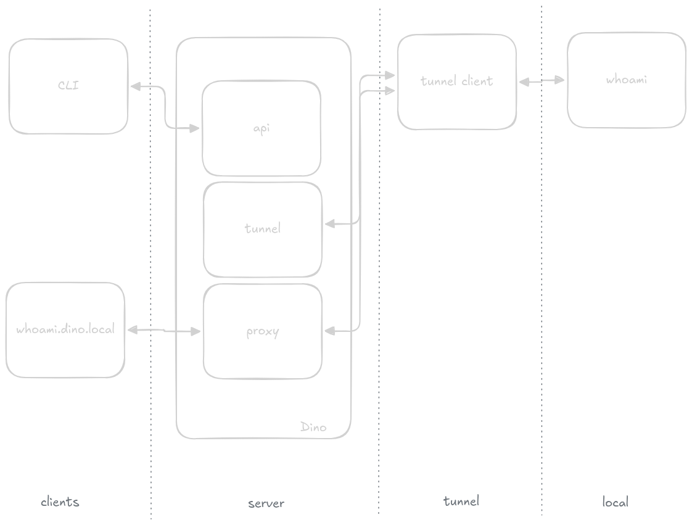

🏗️ Architecture

This document provides a high-level overview of the components that make up Dino and how they interact to provide dynamic routing and tunneling.

📐 System Diagram

⌨️ CLI (Command Line Interface)

The Dino CLI is a statically linked Go binary that acts as the primary administrative tool. It communicates with the Server via gRPC to:

Provision and de-provision tunnels.\
Configure hostname-to-service routing rules.\
Monitor real-time tunnel health and throughput metrics.

🔌 API (Server)

The core of Dino is a high-performance H2C (HTTP/2 Cleartext) server. It serves as the single point of truth for the system state.

Dependency Injection: Built using uber-go/fx for a modular, testable lifecycle.\
Persistence: Manages the state of routes and tunnels (via the Service layer you saw in the code).\
Protocols: Uses gRPC for type-safe, low-latency communication between the CLI and the backend.

󰔚 Tunnel Management

Tunnel Management handles the "Physical" layer of the connection. It abstracts the complexity of different network interfaces into a unified logical tunnel_id.

Isolation: Ensures that traffic arriving on one tunnel cannot "hop" to another unless explicitly routed.\
Lifecycle: Manages the handshake, keep-alives, and clean teardown of network pipes.\
Abstraction: Provides a common interface for Dino to interact with local TUN/TAP devices or remote overlay peers.

󰄱 Proxy (Data Plane)

The Proxy is the engine that moves bits. It is responsible for the actual "forwarding" decision based on the configuration received from the API.

Host-Based Routing: Inspects the SNI or Host header of incoming requests to match them against the active routing table.\
Protocol Translation: Supports mapping incoming traffic to various destination protocols (as defined in dest_protocol).\
Flow Control: Handles the stream multiplexing between a single tunnel entry-point and multiple internal microservices.
